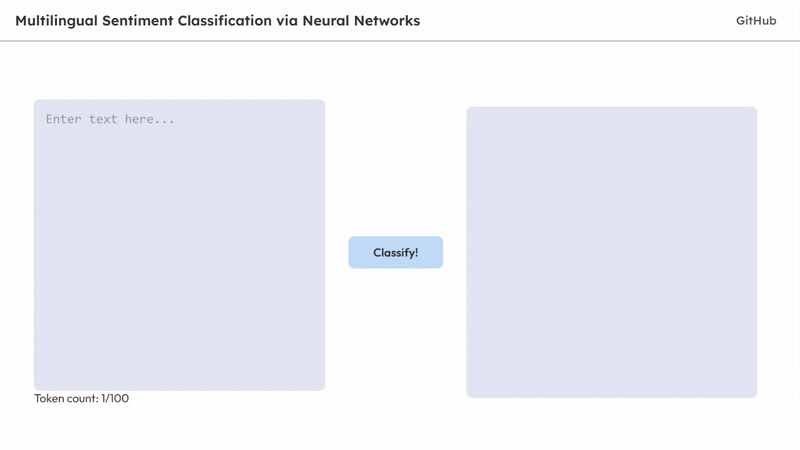

# General Multilingual Text Sentiment Analysis via Neural Networks.
A modular python-based program that fulfills the role of analyzing user input across 48 supported languages. The system uses machine learning and deep learning approaches to classify the *toxicity*, *naive* and *general* sentiments of the texts in any of the 48 languages by featuring a language detection and a translation modules.

## Demonstration

## Tech stack
* Back-end:
    - Python
    - PyTorch
    - Scikit-learn
    - Huggingface's "transformers"
* Front-end:
    - HTML
    - CSS
    - JavaScript
* Models used:
    - **Naive Bayes + count vectorization** - Language classification
    - **Logistic Regression with SGD + count vectorization** - Toxicity detection
    - **RNN with GRUs** - Naive Sentiment classification
    - **Word2Vec BoW model by Omer Levy and Yoav Goldberg** - Word embedding, [link](https://levyomer.wordpress.com/2014/04/25/dependency-based-word-embeddings/)
    - **Facebook's nllb-200-distilled-600M** - Language translation, [link](https://huggingface.co/facebook/nllb-200-distilled-600M)

## Disclaimer
This project is a PoC, an experimental version of how things can look. This is not intended for production use as of right now and there are parts of this system that can be improved upon to make this more reliable.

## How it works
1. User submits text via the front-end.
2. The text is cleaned and broken down into sentences. *Language classifier* classifies the language of the sentence and, if the text is not English, sends this sentence to the *translation model*. This happens with every sentence in the input, which is why this is called the *translation block*.
3. The sentences are later joined together into English text and passed to the *Naive Sentiment Classifier* and *Toxicity Detector* models.
4. The output of those models is saved and the *General Sentiment* is computed (via a simple ruleset).
5. The output is displayed to the user.

#### Why do we divide sentiment into Naive, Toxic and General?
Such division of the sentiments allows for more insight into the text.

* Toxicity Detector can classify text as "Toxic" and "Non-Toxic". Becuase of that it can classify threats and harmful messages.
* Naive Sentiment Classifier classifies text as "Positive", "Neutral" or "Negative". The name "Naive" comes from one specific trait of the dataset: it was made by taking tweets and classifying tweets with ":)" as "Positive", and with ":(" as "Negative". Because of that, with the Naive Sentiment Classifier, it is possible to get a general feeling of the text, but not detect if that is harmful or not (because when people are making threats, they rarely use a sad emoticon).
* General sentiment is a value computed from the Toxic Sentiment and Naive Sentiment by applying a simple ruleset. It can be summed up in three statements:
    - If the *Toxic Sentiment* is "Toxic" **OR** if the *Naive Sentiment* is "Negative" &rarr; *General Sentiment* is "Negative"
    - If the *Toxic Sentiment* is "Non-Toxic" **AND** if the *Naive Sentiment* is "Neutral" &rarr; *General Sentiment* is "Neutral".
    - If the *Toxic Sentiment* is "Non-Toxic" **AND** if the *Naive Sentiment* is "Positive" &rarr; *General Sentiment* is "Positive".

So, as an answer to that question, the *General Sentiment* is a value that represents the overall feeling of the text, and *Toxicity Sentiment* with *Naive Sentiment* are values that go into more details about it.

## Acknowledgements

* [Lena Voita's NLP materials](https://lena-voita.github.io/nlp_course.html)
* [Stanford CS224N: NLP with Deep Learning](https://lena-voita.github.io/nlp_course.html)
* [Dataset 1 for language classification by Basil Saji](https://www.kaggle.com/datasets/basilb2s/language-detection)
* [Dataset 2 for language classification by Chazzler](https://www.kaggle.com/datasets/chazzer/big-language-detection-dataset)
* [Dataset 1 for sentiment analysis by Abhishek Shrivastava](https://www.kaggle.com/datasets/abhi8923shriv/sentiment-analysis-dataset)
* [Dataset 2 for sentiment analysis by Md. Ismiel Hossen Abir](https://www.kaggle.com/datasets/mdismielhossenabir/sentiment-analysis)
* [Dataset for toxicity detection by Julián Peller](https://www.kaggle.com/datasets/julian3833/jigsaw-toxic-comment-classification-challenge)
* [Bag of Words Word2Vec embedding by Omar Levy and Yoav Goldberg with k=5](https://levyomer.wordpress.com/2014/04/25/dependency-based-word-embeddings/)
* [Facebook's nllb-200-distilled-600M for research](https://huggingface.co/facebook/nllb-200-distilled-600M)

## Running the project

1. Clone the repository onto your local machine.
2. In this repository, there are no pre-trained models except for the sentiment classifier. By the end of each `development_part*.ipynb`, there is a code block that is used to save the trained model locally. Download the datasets: [1st LC](https://www.kaggle.com/datasets/basilb2s/language-detection), [2nd LC](https://www.kaggle.com/datasets/chazzer/big-language-detection-dataset), [Toxicity Detection](https://www.kaggle.com/datasets/julian3833/jigsaw-toxic-comment-classification-challenge).
3. Make sure the paths to the downloaded files are valid in the Jupiter Notebooks. You may need to unpack some of them first, as a couple contain multiple files.
4. Run the training code located in `development_part1.ipynb` and `development_part3.ipynb` and then save the model with the last blocks of code. You do not need to run the **PyTorch** training code, as that model is present in the repository.
5. Before running `server.py`, make sure all `*_PATH` variables are set to valid paths of your saved models.
6. Run `server.py`.
7. Run `index.html`, preferably with some local server (for example, *VSCode Live Server extension*).